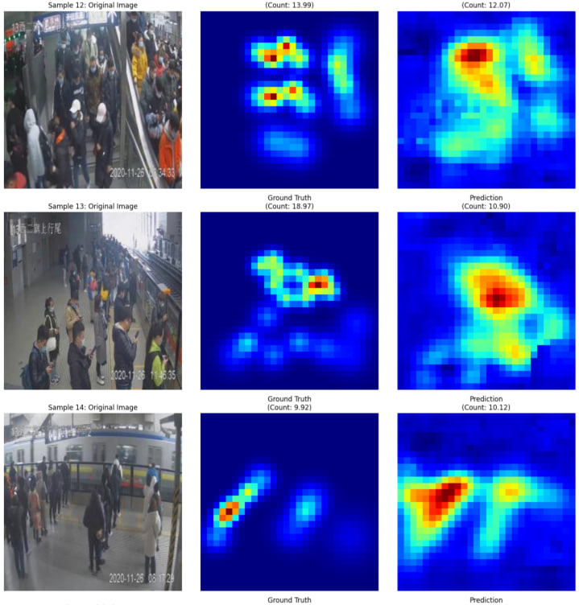

# BusFullness: ESP32 + Edge Impulse

Проект для оценки заполненности автобуса на базе ESP32‑CAM и модели, экспортированной из Edge Impulse. В репозитории есть:

- `model_training_and_export.ipynb` — блокнот с обучением и экспортом модели.
- `esp32_camera/esp32_camera.ino` — прошивка для ESP32‑CAM, запускающая инференс и отправляющая результат на бэкенд.
- `ei-2gis-arduino-1.0.4.zip` — Arduino‑библиотека с моделью (инференс SDK + модель), подключаемая в IDE.
- `photo_2025-10-05_09-27-06.jpg` — пример выхода нейросети.



## Требования

- Arduino IDE 2.x (или 1.8.x).
- Пакет плат ESP32 установлен в Arduino IDE (проверено с ESP32 core 2.0.4).
- Модуль ESP32‑CAM с PSRAM (например, AI Thinker / ESP‑EYE).

## Установка библиотеки модели в Arduino IDE

Есть два способа установить библиотеку с моделью из файла `ei-2gis-arduino-1.0.4.zip`:

1) Через меню IDE (рекомендуется):
	 - Откройте Arduino IDE.
	 - Меню: Скетч → Подключить библиотеку → Добавить библиотеку .ZIP…
	 - Выберите файл `ei-2gis-arduino-1.0.4.zip` в корне этого репозитория.
	 - После установки в скетче станет доступен заголовок `#include <a2gis_inferencing.h>`.

2) Вручную (Windows):
	 - Распакуйте `ei-2gis-arduino-1.0.4.zip` в папку `%USERPROFILE%\Documents\Arduino\libraries\` (если папки `libraries` нет — создайте её).
	 - Перезапустите Arduino IDE, проверьте, что библиотека появилась в Скетч → Подключить библиотеку.

## Что настроить в прошивке

Откройте файл `esp32_camera/esp32_camera.ino` и задайте свои параметры сети и бэкенда:

- `const char* ssid = "YOUR_WIFI_SSID";` — имя вашей Wi‑Fi сети.
- `const char* password = "YOUR_WIFI_PASSWORD";` — пароль Wi‑Fi.
- `const char* serverUrl = "http://127.0.0.1:8000/api/camera/measurement?camera_id=34";` — URL вашего бэкенда (HTTP POST). Параметр `camera_id` передаётся в query‑строке URL. При необходимости замените `34` на идентификатор вашей камеры.
- `const int CAMERA_ID = 34;` — константа идентификатора камеры (для удобства синхронизируйте её со значением в параметре `camera_id` URL).

Дополнительно о пинах камеры:

- В начале файла есть преднастройки для разных модулей (AI Thinker, ESP‑EYE). По умолчанию активирован кастомный пин-аут через набор `#define PWDN_GPIO_NUM ...` и т.д.
- Если у вас модуль AI Thinker или ESP‑EYE, раскомментируйте соответствующую строку `#define CAMERA_MODEL_AI_THINKER` или `#define CAMERA_MODEL_ESP_EYE` и закомментируйте блок с кастомными пинами, чтобы использовать стандартный пин‑аут для вашей платы.

## Что отправляет ESP32 на сервер

При каждом цикле инференса устройство отправляет HTTP POST на `serverUrl` со следующими заголовками и телом:

- Заголовки:
	- `Content-Type: application/json`
	- `Accept: application/json`
- Тело (JSON):
	```json
	{ "occupancy_pct": 0.42 }
	```

Где `occupancy_pct` — оценка заполненности в диапазоне от 0 до 1. Значение вычисляется из результата модели и дополнительно нормализуется в прошивке; при необходимости вы можете изменить логику нормализации под свой кейс.

Идентификатор камеры передаётся в URL в виде query‑параметра `camera_id`, например:

```
http://<host>:<port>/api/camera/measurement?camera_id=34
```

Ответ сервера (строка/JSON) выводится в Serial‑лог вместе с кодом ответа HTTP.

Примечание: В примере используется HTTP. Для HTTPS потребуется использовать `WiFiClientSecure` и настроить доверенный сертификат сервера.

## Сборка и прошивка

1. Установите пакет плат ESP32 через Менеджер плат в Arduino IDE (рекомендуемая версия — 2.0.4).
2. Откройте `esp32_camera/esp32_camera.ino`.
3. Выберите вашу плату ESP32 (для модулей с камерой часто подходит «ESP32 Wrover Module» или «AI Thinker ESP32‑CAM»), укажите правильный порт.
4. Включите PSRAM (если доступно), скорость порта 115200 бод.
5. Нажмите «Загрузить» для прошивки устройства.
6. Откройте Serial Monitor (115200), дождитесь подключения к Wi‑Fi и начала инференса. В логе будут строки вида: `Predictions`, `Occupancy:`, `HTTP Response code:` и ответ сервера.

## Структура данных модели и инференс

Модель подключается через `#include <a2gis_inferencing.h>`. Камера захватывает кадр QVGA (320×240, RGB888), данные подаются в импульс (`run_classifier`). Прошивка выводит лог вероятностей и рассчитывает метрику заполненности `occupancy_pct`, которую отправляет на бэкенд.

## Частые проблемы

- «Camera init failed» — проверьте выбранную модель камеры и соответствие пин‑аута вашей плате; убедитесь, что PSRAM включен (для ESP32‑CAM это критично).
- «WiFi Disconnected» — проверьте SSID/пароль и близость точки доступа.
- Нулевой/отрицательный код HTTP — проверьте доступность URL сервера из сети устройства, корректность пути и параметров.

---


